说明
==

15-1
----

**15.4 节中描述了针对各种文件系统操作所需的权限。请使用 shell 命令或编写程序来回答或验证以下说法。**

**a）将文件属主的所有权限“剥夺”后，即使“本组”和“其他”用户仍有访问权，属主也无法访问文件。**

**b）在一个可读但无可执行权限的目录下，可列出其中的文件名，但无论文件本身的权限如何，也不能访问其内容。**

**c）要创建一个新文件，打开一个文件进行读操作，打开一个文件进行写操作，以及删除一个文件，父目录和文件本身分别需要具备何种权限？对文件执行重命名操作时，源及目标目录分别需要具备何种权限？若重命名操作的目标文件已存在，该文件需要具备何种权限？为目录设置 sticky 位(chmod +t)，将如何影响重命名和删除操作？**

a.

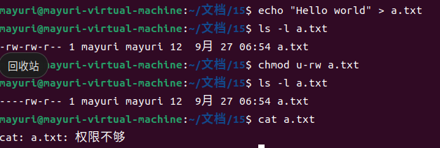

按照书p247的示例即可。

b.

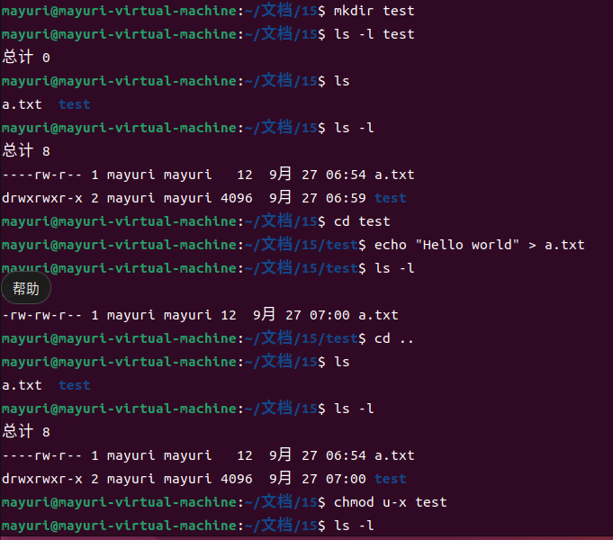

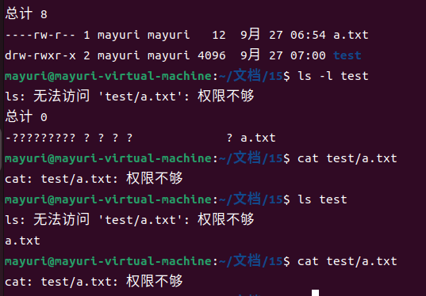

可以看到在ls的时候就会提醒无法访问test/a.txt了，即使依然可以列出文件名

c.

创建文件：父目录需要拥有执行和写权限，文件本身不需要权限，因为是创建文件，文件创建前还不存在。

我本来以为只需要写权限就够了，因为书上说是写权限涉及能否创建/删除目录中的文件，后来才发现也需要执行权限，因为写本身其实也算是一种对文件的访问吧。

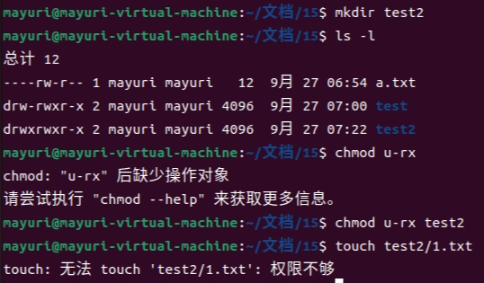

对一个文件进行读写操作：父目录需要拥有执行权限，如果知道文件名就不需要读权限，写权限是用来创建和删除文件的，所以不需要写权限。而对文件本身则需要读/写权限。

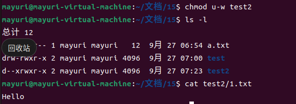

删除文件：父目录需要执行和写权限。对于文件本身则没有任何要求。

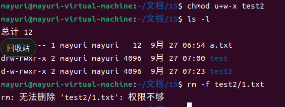

对文件执行重命名：这里我不是很理解，重命名不是在一个目录下面进行的吗？要是有源目录和目标目录那就不是重命名了，而是移动文件了。我这里就按照移动文件来说明。源目录需要执行和写权限，因为要需要把源目录中的文件删除。而目标目录也需要执行和写权限，因为要在目标目录创建文件。

如果名字已存在，那么文件本身就需要写入权限，因为需要修改文件信息。

sticky：可以直接看书：

> 在现代 UNIX 实现（包括 Linux）中，sticky 权限位所起的作用全然不同于老的 UNIX 实现。作用于目录时，sticky 权限位起限制删除位的作用。为目录设置该位，则表明仅当非特权进程具有对目录的写权限，且为文件或目录的属主时，才能对目录下的文件进行删除（unlink()、rmdir()）和重命名（rename()）操作。（具有 CAP\_FOWNER 能力的进程可省去对属主的检查。）可藉此机制来创建为多个用户共享的一个目录，各个用户可在其下创建或删除属于自己的文件，但不能删除隶属于其他用户的文件。为/tmp 目录设置 sticky 权限位，原因正在于此。

15-2
----

**你认为系统调用 stat()会改变文件 3 个时间戳中的任意之一吗？请解释原因。**

并不会。因为stat系统调用访问的不是文件本身，而只是文件inode。

15-3
----

**在运行 Linux 2.6 的系统上修改程序清单 15-1(t\_stat.c)，令其可以纳秒级精度来显示文件时间戳。**

根据stat的manual:

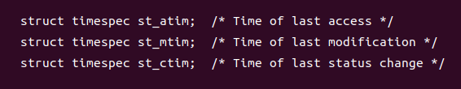

而timespec是长这个样子的：

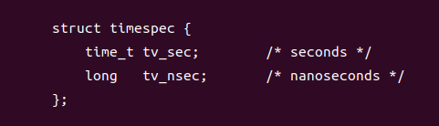

代码很简单，我就不改了。

15-4
----

**系统调用 access()会利用进程的实际用户和组 ID 来检查权限。请编写相应函数，根据进程的有效用户和组 ID 来进行权限检查**

这道题的题目非常不清晰，可以有两种不同的理解方式：

*   通过调用access来根据进程的有效用户和组ID来进行权限检查
*   自己实现根据进程的有效用户和组ID来进行权限检查，题目中提到access只是一个引子，因为它是按照实际用户和组ID检查的

我两种理解方式都写下吧。

第一种理解方式非常简单，只要将进程的ruid和rgid短暂地设置成euid和egid，最后再恢复即可。

第二种理解方式需要根据书中检查文件权限的规则来写：

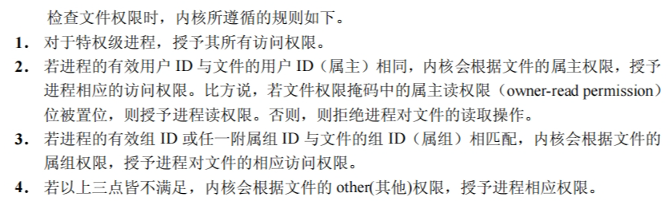

我的实现方式与access一致，毕竟题目中提到了access。也就是说，参数列表和返回规则是和access一致的。

这是access系统调用的返回规则：

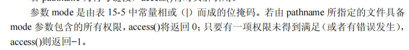

第二种理解中我犯了很多错误，我基本写在注释当中了。

15-5
----

**15.4.6 节所述，umask()总会在设置进程 umask 的同时返回老 umask 的拷贝。请问，如何在不改变进程当前 umask 的同时获取到其拷贝？**

在linux 4.7之后，我们可以在/proc/PID/status中找到mask了。而如果在linux4.7之前，我们只能通过调用umask两次的方式获得拷贝，一次改变，一次复原：

```null
mode_t curMask = umask(0);
umask(curMask);
```

15-6
----

**命令 chmod a+rX file 的作用是对所有各类用户授予读权限，并且，当 file 是目录，或者 file 的任一用户类型具有可执行权限时，将向所有各类用户授予可执行权限，如下例所示：**

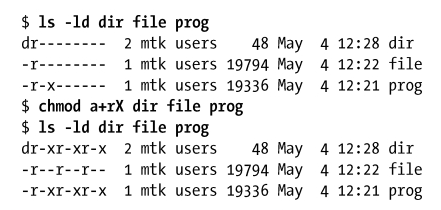

**使用 stat()和 chmod()编写一程序，令其等效于执行 chmod a+rX 命令**

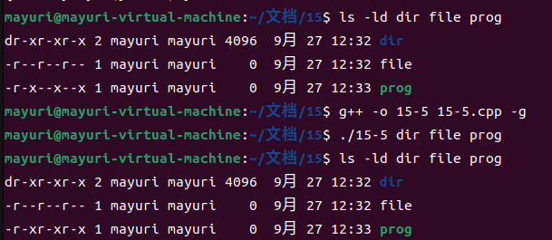

我一开始忘记使用chmod了，我以为直接修改statbuf中的值就足够了。然而statbuf就是个结构体，即使修改这个结构体，也是影响不到原来的文件的信息的，需要使用chmod系统调用。

我一开始是调用了两次chmod，但是第二次中的st\_mode用的是最初的那个，而不是加入了三个读取权限之后的，导致第一次的结果直接被覆盖了！最后我是采用了将要改的mode存储在一个变量中的方式，只在最后进行一次chmod。

15-7
----

**编写 chattr(1)命令的简化版来修改文件的 i 节点标志。参阅 chattr(1) 手册页以掌握chattr 命令行接口的细节。（无需实现-R、-V、-v 选项。）**

需要用到i节点标记：

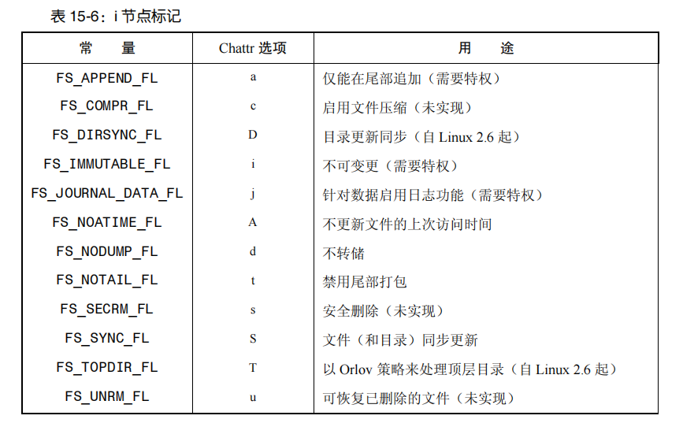

看上去实现一个命令很复杂，实际写起来倒是蛮简单的。题目中说：

> **无需实现-R、-V、-v 选项**

但我通过manual发现还剩下-p和-f，让我瞬间很懵。但是我看了具体描述，我也不知道该怎么实现，于是作罢，我只实现了最最基础的chattr，就是单纯的change attribute。

chattr似乎是可以同时对多个文件操作的，但我只实现了对一个文件操作，文件路径直接取了argv\[argc - 1\]。如果要处理多个，那么就需要一个fd数组，记录下每个文件描述符。同时需要借助一个中间变量来记录+-=的东西，而不能直接ioctl后在flags上改（因为你在循环过程中不知道要对多少个fd进行这样的操作，而ioctl是需要fd作为参数的）。

如果要实现选项的话，那么肯定需要用到getopt。因为选项必须在文件模式前面，而optind是下一个待解析的位置，那么遍历就从optind开始。