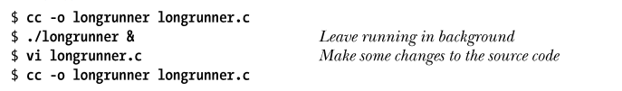
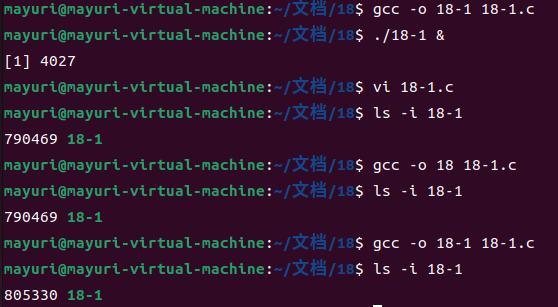
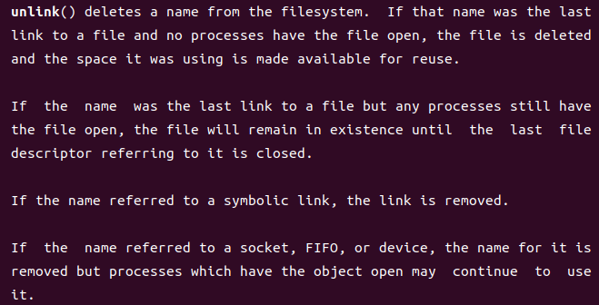
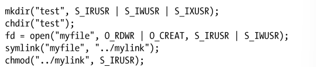
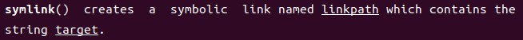
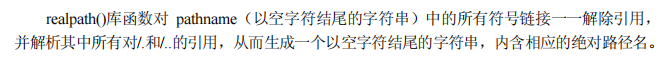
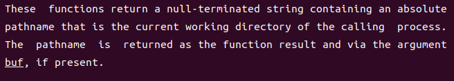
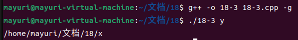
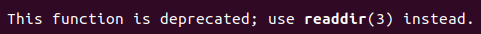

说明
==

18-1
----

**4.3.2 节曾指出，如果一个文件正处于执行状态，那么要将其打开以执行写操作是不可能的（open()调用返回−1，且将 errno 置为 ETXTBSY）。然而，在 shell 中执行如下操作却是可能的：**

**最后一条命令覆盖了现有的同名可执行文件。原因何在？（提示：在每次编译后调用 ls –li 命令来查看可执行文件的 i-node 编号。）**

gcc会unlink原本的18-1，并为新修改的18-1分配新的inode编号。那为什么18-1仍然在运行？我们可以看看unlink的manual：

很显然，unlink后虽然计数会变为0，但是原本的18-1仍然处于打开状态，所以18-1会继续运行下去，直到进程结束。等到进程结束之后，原先的18-1就会被释放。

18-2
----

**以下代码中对 chmod()的调用为什么会失败？**

看一下symlink的manual：

也就是说，../mylink所指向的是myfile，而不是test/myfile(因为之前的代码告诉我们已经将当前工作目录转移到了test下，而myfile是test目录下的文件)。

这就导致了悬空链接的问题，从而导致了chmod的失败。

18-3
----

**实现realpath()。**

首先要理解realpath究竟做了些什么：

我一开始以为pathname是一个目录，可以解析这个目录里面所有对./和../的引用，于是我就搞不懂这最后生成的以空字符串结尾的字符串是哪来的。之后才发现我误会了，是解析pathname单单这个文件名当中的所有对./和../的引用。也就是说，realpath的作用就是获得pathname的绝对路径。

我一开始的思路是通过C库中的strtok或者是C++string中的find\_first\_of来按照‘/’分割字符串，通过readlink检查每一个部分是符号链接还是硬链接。软链接就解析后加入resolved中，硬链接就直接加入。但是这个思路的问题在于处理.和..的时候比较麻烦，一个要通过getcwd获得当前目录，一个要通过string的find\_last\_of在getcwd的返回结果中父目录，而且也没有用太多书中介绍的系统调用和库函数。

所以最终我参考了别人的思路。其中关键就是递归+getcwd。

getcwd是能够返回绝对路径的，参考manual:

通过chdir和getcwd的配合使用，就可以很轻松获得绝对路径，而不需要复杂的字符串操作。但是getcwd智能获得当前目录的绝对路径，而不是文件的，所以需要配合dirname和basename使用。

递归的存在意义在于，符号链接指向的仍然可能是符号链接，所以要采取符号链接的形式。

这里的dirname和basename都是可能改变原来字符串的，所以要拷贝两份。我在拿书中的y做测试的时候，dirname完，复制的那份就从./y变成了.,导致base出问题。

其实我之前的思路也是可以的，只不过确实过于繁琐，等日后有空我再来实现。

18-4
----

**修改程序清单 18-2 中的程序，用 readdir \_r()来取代 readdir()**

令人感叹，这题就不写了。

18-5
----

**实现一个功能与 getcwd()相当的函数。提示：要获得当前工作目录的名称，可调用opendir()和 readdir()来遍历其父目录（..）中的各个条目，查找其中与当前工作目录具有相同 i-node 编号及设备编号（即，分别为 stat()和 lstat()调用所返回 stat 结构中的 st\_ino 和 st\_dev 属性）的一项。如此这般，沿着目录树层层拾级而上（chdir("..")）并进行扫描，就能构建出完整的目录路径。当父目录与当前工作目录相同时（回忆/..与/相同的情况），就结束遍历。无论调用该函数成功与否，都应将调用者遣回其起始目录（使用 open()和 fchdir()能很方便地实现这一功能）。**

这道题主要是个理解的问题，关键就是搞明白getcwd是需要返回一个绝对路径的，所以才需要根据题目的提示一样一层层进行返回。

而在检查是否到达根目录的时候，判断标准就是：

> **查找其中与当前工作目录具有相同 i-node 编号及设备编号**

为什么既要判断inode编号是否相同，还要判断设备编号是否相同呢？因为还要确认是否为同一个文件系统，不同的文件系统中的相同inode编号会指向不同的文件。

18-6
----

**使用 FTW\_DEPTH 标志来修改程序清单 18-3(nftw\_dir\_tree.c)中的程序。注意目录树遍历顺序的差异。**

不是很懂这道题想让我们做什么，感觉不需要改变18-3什么。应该就是让我们看看前序和后序遍历的差异？

18-7
----

**编写一程序，使用 nftw()来遍历目录树，并打印出树中各类文件（普通文件、目录、符号链接等）的总和及百分比。**

这道题我也不写了，意义不是很大，就是计数即可。感觉这道题的意义在于让我们熟悉一下nftw的调用。

不过有一点要注意的是，要设置flag来确保不对符号链接进行解引用。

18-8
----

**实现 nftw()。（需要使用 opendir()、readdir()、closedir()和 stat()等系统调用。）**

这个我实在是有点不太想写了，感觉各种flag的宏太复杂了。。。

我觉得几个比较难的地方:

*   nopenfd 这代表需要记录下所有的文件描述符，并且要在超过上限后关闭文件描述符
*   前序遍历和后序遍历的实现 一个是先处理目录中的文件，再处理目录本身；一个是先处理目录本身，再处理目录的文件
*   还有就是各种宏了，功能实在是太多。。。感觉想实现这个nftw建立在本身就对nftw的功能有着足够的了解的基础上

以后有空了再来实现吧。

18-9
----

**18.10 节展示了两种技术（分别为 fchdir()和 chdir()），用于在将当前工作目录转到另一位置后，再返回之前的当前工作目录。假设需要反复执行这一操作，哪种方法更为高效？原因何在？请写一段程序加以验证**

理论上fchdir应该是要比chdir更加快的，我也就不加验证了。等我学完了软件系统优化之后再来补代码吧。

快的原因在于，fchdir只需要一个文件描述符即可，而chdir需要的则是一个字符串。操作字符串所需要的时间肯定是要比操作一个整型需要的时间长的。