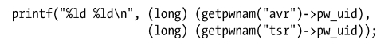
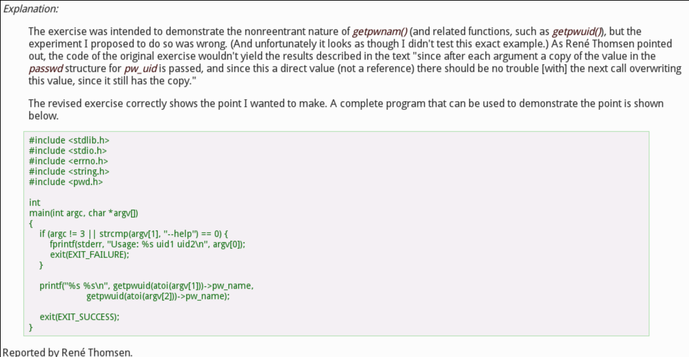
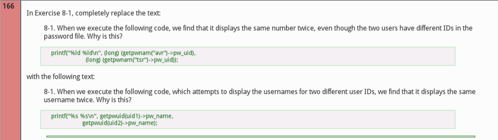
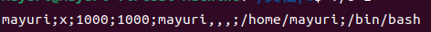

说明
==

8-1
---

**执行下列代码时，将会发现，尽管这两个用户在密码文件中对应不同的 ID，但该程序的输出还是会将同一个数字显示两次。请问为什么？**



这道题我其实一开始自己做的时候毫无思路，因为这道题本质上要用到后面的知识点，而我目前还什么都不知道。而且，这道题出的是错误的，而且作者本人都进行了勘误：





（放图是因为链接已经打不开了）

我通过搜索引擎进行了搜索，目前搜索到的最最通俗易懂的解释是在stackoverflow之上：[c - statically allocated variable when using getpwnam() - Stack Overflow](https://stackoverflow.com/questions/37043139/statically-allocated-variable-when-using-getpwnam)

我在这里对这一题做一下总结：

题目中原本所给出的代码的运行结果其实是能够给出正确的答案的，原因在于给printf传入参数的时候，传入的是值，而不是引用或者指针。而作者原本认为会给出一样的uid的根据在于：

> getpwnam()和 getpwuid()均会返回一个指针，指向一个静态分配的结构。对此二者（或是下文描述的 getpwent()函数）的任何一次调用都会改写该数据结构。

如果是运行作者更正后的代码，那就会得到预期的结果，因为用户名是字符串，也就是指针。

8-2
---

**使用 setpwent()、getpwent()和 endpwent()来实现 getpwnam()。**

这道题我起初的实现非常简单，就是先通过endpwent定位到文件起始，然后通过getpwent逐行遍历，看看name是否相等，循环完成后循环变量要么是NULL，要么是我们需要的，所以直接return即可，不过别忘了endpwent。

但是，阅读getpwent的manual：

> The return value may point to a static area, and may be overwritten bysubsequent calls to getpwent(), getpwnam(3), or getpwuid(3). (Do notpass the returned pointer to free(3).)

may告诉我们getpwent返回的未必是一个静态数据，但是getpwnam是确定必须要返回静态数据的，所以我的这种实现其实是错的。

解决办法就是我们自己声明一个static struct passwd \*，然后一一进行赋值即可。

但是思路虽然很简单，但是实现起来我遇到了很大困难。我最初是这么定义static struct passwd \*的：

```null
char pw_name[30];
char pw_pwd[30];
uid_t pw_uid;
gid_t pw_gid;
char pw_gecos[30];
char pw_dir[30];
char pw_shell[30];
static struct passwd pwd = {pw_name, pw_pwd, pw_uid, pw_gid, pw_gecos, pw_dir, pw_shell};
```

然后就是喜闻乐见地出现了报错，因为**初始化一个静态结构体的时候必须要常量表达式**。于是我后来将上面所有的定义都增加了static，但是在pw\_pwd和pw\_uid依然出现了报错，因为这两个得要初始化。但是我没办法初始化！因为这两个的值是要在后面的循环中才知道的。

可以看出我当时的想法有多么愚蠢。pwd那一行并不是说把上面的定义的变量都挪到了pwd所在的区域，而是复制了上面一份变量进入pwd的区域。其实根本不需要pw\_uid和pw\_gid即可，直接传入一个常量即可。

但是由于**初始化一个静态结构体的时候必须要常量表达式**，所以是无法用malloc初始化static struct的，所以剩下的还是得保留。

也可以看出我现在的想法有多愚蠢。

就在刚刚我终于把思路想通了。

首先，我们根本不需要对pwd进行初始化，直接默认初始化就行了。因为结构体内保存的仅仅是一个指针，这个指针指向哪里都可以，指向堆，指向栈，结构体里面的就仅仅是一个指针而已。其实想通了这个就好了，之后根据找到的内容动态分配内存大小，再把指针传递给结构体就好了。而且动态分配是非常满足我们的需求的，静态对象本来就需要存在整个程序运行期间，而动态分配的内存我们不手动free是不会释放的。

最后两种实现方式的代码全部跑通，结果如下：

