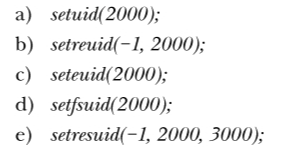
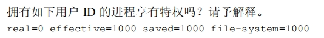
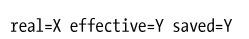
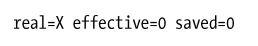
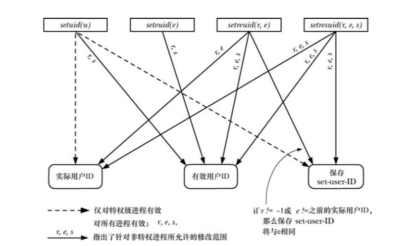

说明
==

9-1
---

**在下列每种情况中，假设进程用户 ID 的初始值分别为 real（实际）=1000、effective（有效）=0、saved（保存）=0、file-system（文件系统）=0。当执行这些调用后，用户 ID 的状态如何？**



注意，不是依次进行！是对于原始初始值分别执行adcde！有效用户id为0，说明当前是特权进程

a.r=2000, e=2000,s=2000,f=2000

b.r=1000, e=2000,s=2000,f=2000 这里还要注意是否满足条件对saved进行修改

c.seteuid对于特权进程是可以进行修复的，所以r=1000, e=2000,s=0,f=2000

d.r=1000, e=0,s=0,f=2000

e.real=1000, effective=2000, saved=3000, file-system=2000 file-system跟随有效用户id的变化

对照书最后给出的表格即可。

9-2
---



并没有，因为它的effective不为0。但是，它随时可以获得特权，通过seteuid(0)即可，因为它的real为0，所以这条系统调用是可以成功的。

9-3
---

**使用 setgroups()及库函数从密码文件、组文件（参见 8.4 节）中获取信息，以实现**

**initgroups()。请注意，欲调用 setgroups()，进程必须享有特权。**


在/etc/group中记录了每个组所包含的用户，而这里就是从属组。如果是属主是不会记录在/etc/group中的，而是会记录在密码文件当中。所以基本的思路就是遍历/etc/group中的每一条记录，再遍历每一条记录中的指针数组，看看有没有和user匹配的。

这里如果是C++，应该使用动态数组，因为事先并不知道会有多少个辅助组。但可惜这是C，只能动态分配一个固定长度的。

另外要注意执行程序的时候要加sudo，在代码中是无法通过系统调用将进程的effective置为0的，因为set顶多置为实际id和saved。可以采用chown再chmod的方式，运用set-user-id让进程转化为特权级。但是要用chown的前提必须是root，所以我还是选取了运行程序时直接sudo的方式。

9-4
---

**假设某进程的所有用户标识均为 X，执行了用户 ID 为 Y 的 set-user-ID 程序，且 Y**

**为非 0 值，对进程凭证的设置如下：**



**（这里忽略了文件系统用户 ID，因为该 ID 随有效用户 ID 的变化而变化。）为**

**执行如下操作，请分别列出对 setuid()、seteuid()、setreuid()和 setresuid()的调用。**

**a） 挂起和恢复 set-user-ID 身份（即将有效用户 ID 在实际用户 ID 和保存**

**set-user-ID 间切换）。**

**b） 永久放弃 set-user-ID 身份（即确保将有效用户 ID 和保存 set-user-ID 设置**

**为实际用户 ID）。**

**（该练习还需要使用getuid()和geteuid()函数来获取进程的实际用户ID和有效用**

**户 ID。）请注意，鉴于上述列出的某些系统调用，部分操作将无法实现**

a.

```null
int oldUid = geteuid();
//setuid
setuid(getuid());
setuid(oldUid);

//seteuid
seteuid(getuid());
seteuid(oldUid);

//setreuid
setreuid(-1, getuid());
setreuid(-1, oldUid);

//setresuid
setreuid(-1, getuid(), -1);
setreuid(-1, oldUid, -1);
```

b.

```null
//setuid无法做到，因为不能修改saved
//seteuid无法做到，因为不能修改saved

//setreuid
setreuid(getuid(), getuid())//第一个参数不为-1 会设置saved

//setresuid
setresuid(getuid(), getuid(), getruid())
```

9-5
---

**针对执行 set-user-ID-root 程序的进程，重复上述练习，进程凭证的初始值如下：**



a.

```null
//setuid 无法做到挂起和修复 因为setuid对于特权进程来说一下子设置就是三个全部设置
//seteuid 
seteuid(getuid());
setuid(0);

//setreuid
setreuid(-1, getuid());
setreuid(-1, 0);

//setresuid
setresuid(-1, getuid(), -1)
setresuid(-1, 0, -1)
```

b.

```null
//setuid
setuid(getuid());

//seteuid 无法做到 因为无法修改saved

//setreuid
setreuid(getuid(), getuid());

//setresuid
setresuid(getuid(), getuid(), getuid());
```

总结
--



这张图非常重要，所展示的信息要比那张表格更多，因为这张图还列出了每个系统调用是否会保存set-user-id的值。