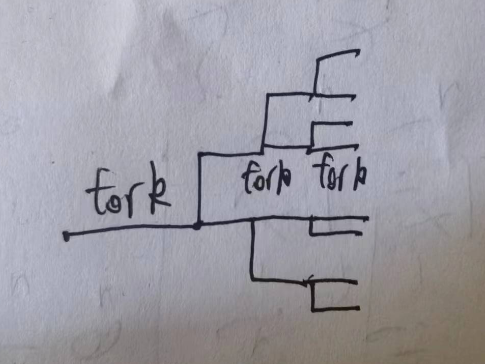

# chapter -24

## 24-1

**程序在执行完如下一系列 fork()调用后会产生多少新进程（假定没有调用失败）？**

```C
fork();
fork();
fork();
```

根据csapp中的内容画张图就能轻松很多了，最后总共会有8个进程，也就是说会有7个新进程。

  

## 24-2

**编写一个程序以便验证调用 vfork()之后，子进程可以关闭一文件描述符（例如：描述符 0）而不影响对应父进程中的文件描述符。**

可以选择关闭STDOUT_FILENO，然后在父进程和子进程分别调用write，看看输出结果即可：

```shell
mayuri@mayuri-virtual-machine:~/文档/24$ g++ -o 24-2 24-2.cpp
mayuri@mayuri-virtual-machine:~/文档/24$ ./24-2
child process is about to close STDOUT_FILENO
parent process is about to write to STDOUT_FILENO
you should see this
```

## 24-3

**假设可以修改程序源代码，如何在某一特定时刻生成一核心转储（core dump）文件，而同时进程得以继续执行？**

fork一个子进程，在子进程中直接调用abort()即可。但是这里我有个搞不懂的点，就是为什么没有按照预期生成coredump。我使用ulimit -c发现输出为0，然后我就通过ulimit -c unlimited修改了coredump文件大小上限，但是依然无法生成。还有一件很奇怪的事情，我在上课前通过ulimit -c unlimited

```shell
mayuri@mayuri-virtual-machine:~/文档/24$ ulimit -c
0
mayuri@mayuri-virtual-machine:~/文档/24$ ulimit -c unlimited
mayuri@mayuri-virtual-machine:~/文档/24$ ulimit -c
unlimited
```

但是我到教室重新开始做，就变成了这样:

```shell
mayuri@mayuri-virtual-machine:~/文档/24$ ulimit -c
0
mayuri@mayuri-virtual-machine:~/文档/24$ ulimit -c unlimited
bash: ulimit: core file size: 无法修改限制：不允许的操作
mayuri@mayuri-virtual-machine:~/文档/24$ sudo ulimit -c unlimited
sudo: ulimit：找不到命令
```

我搜索了一下，发现原因在于本身是不存在ulimit的二进制文件的，这点也可以反映在你去man ulimit，最后出来的是一个系统调用。ulimit是shell内置的一个命令。
参考：<https://stackoverflow.com/questions/17483723/command-not-found-when-using-sudo-ulimit>

我使用链接中的解决方法，成功进行了修改：

```shell
mayuri@mayuri-virtual-machine:~/文档/24$ sudo prlimit --pid=$$ --core=unlimited
[sudo] mayuri 的密码： 
mayuri@mayuri-virtual-machine:~/文档/24$ ulimit -c
unlimited
```

但是依然无法生成coredump。
我还检查了我对于目录的权限，也是有写入权限的；我还通过signal将SIGABRT的处理器回归了默认，也还是不行。

## 24-4

**在其他 UNIX 实现上实验程序清单 24-5（fork_whos_on_first.c）中的程序，并判断在执行 fork()后这些系统是如何调度父子进程的。**

我没有其他UNIX实现了，就不实现了。

## 24-5

**假定在程序清单 24-6 的程序中，子进程也需要等待父进程完成某些操作。为确保达成这一目的，应如何修改程序？**

基本的逻辑如下:

- 子进程完成一部分工作，完成后通过kill通知父进程，自身开始等待
- 父进程也做一部分工作，做完后kill通知子进程，自身开始等待
- 子进程收到父进程信号，开始完成剩余工作，完成后kill通知父进程，自身结束
- 父进程收到信号，继续向下执行
